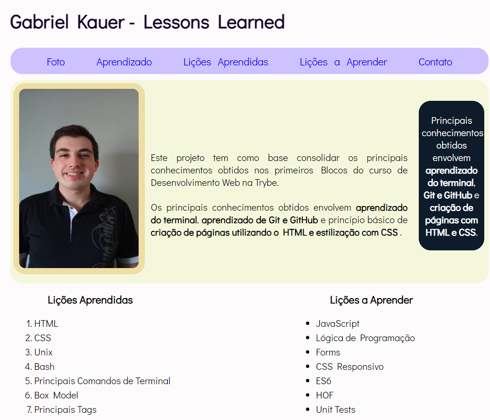

# Boas vindas ao repositório do projeto <b>Lessons Learned</b>!

Esse projeto foi desenvolvido durante o módulo de Fundamentos na Trybe! #vqv 

Aqui você vai encontrar os detalhes de como foi o desenvolvimento do projeto e quais foram os requisitos técnicos necessários para a entrega do desafio.



---

# Habilidades desenvolvidas

Neste projeto, fui capaz de:

- Utilizar HTML para construir páginas web.
- Utilizar HTML semântico para tornar a página mais acessível e melhor ranqueada.
- Utilizar CSS para adicionar estilo e posicionar elementos.

---

# Funcionamento da aplicação

Para iniciar o projeto, é necessário rodar o comando
```
npm install
```
para que as dependências do projeto sejam instaladas.

Para visualizar o projeto no navegador, você pode utilizar a extensão `Live Server` do Visual Studio Code, que executará o arquivo `index.html` diretamente no navegador.

---

# Requisitos técnicos do desafio:

- ✅ 1. Adicione uma cor de fundo específica para a página.

- ✅ 2. Adicione uma barra superior com um título.

- ✅ 3. Adicione uma foto sua à página.

- ✅ 4. Adicione uma lista de lições aprendidas à página.

- ✅ 5. Crie uma lista de lições que ainda deseja aprender para a página.

- ✅ 6. Adicione um rodapé para a página.

- ✅ 7. Insira pelo menos um link externo na página.

- ✅ 8. Crie um artigo sobre seu aprendizado.

- ✅ 9. Crie uma seção que conta uma passagem sobre seu aprendizado.

- ✅ 10. Aplique elementos HTML de acordo com o sentido e propósito de cada um deles. Para tornar o seu site mais acessível e melhorar seu ranqueamento em mecanismos de busca na Web, sua página deve conter os seguintes elementos: article, header, nav, section, aside e footer.

- ✅ 11. Teste a semântica da sua página está aprovada pelo site CodeSniffer.

--- 

# REQUISITOS BÔNUS

- ✅ 1. Adicione uma tabela à página.

- ✅ 2. Utilize o Box model.

- ✅ 3. Altere atributos relacionados as fontes.

- ✅ 4. Posicione o seu artigo e a seção sobre aprendizados um ao lado do outro.
